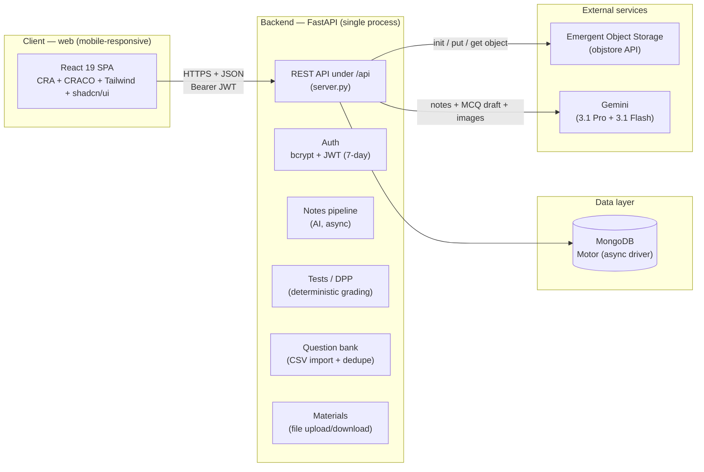

# VidyaLab (School of Maths) — System Architecture v2.0

**Version:** 2.0
**Date:** 2026-08-30
**Status:** Current (matches the live codebase + `docs/SPEC_v3.0.md` build order)
**Supersedes:** `docs/archive/system_architecture_v1.0.pdf` (the rejected Flutter / Node.js / PostgreSQL direction)
**Source of truth:** `docs/SPEC_v3.0.md`

> This document describes the system **as it actually is** — the running FastAPI + MongoDB +
> React 19 codebase — and marks the spec v3.0 items that are still planned (not yet built) explicitly.
> Anything in this document can be traced to a concrete file, endpoint, collection, or dependency.

---

## 1. Executive Summary

VidyaLab is a single-teacher coaching-center platform (Classes 9–10, CBSE) delivered as a
**mobile-responsive web app**. It evolved from an existing codebase rather than a rewrite:
the MVP keeps the working FastAPI backend, MongoDB database, and React 19 frontend, and layers the
new question-bank / test / mastery features on top.

The architecture is deliberately **small and monolithic**:

- **One Python process** (`backend/server.py`) serves the entire REST API.
- **One MongoDB database** holds all state (no separate cache or queue in the MVP).
- **One React SPA** (`frontend/`) is the only client.
- **Two external services**: Emergent Object Storage (files) and Gemini (AI notes / drafting).

There is **no** microservice layer, **no** Redis, **no** PostgreSQL, **no** message queue, and
**no** payment/monetization in the MVP (all explicitly deferred in SPEC v3.0 §8).

---

## 2. Architecture Overview



**Request path:** browser → React SPA → `axios` (`REACT_APP_BACKEND_URL/api`) → FastAPI → Motor/MongoDB
and/or object storage / Gemini → JSON response.

---

## 3. Technology Stack (verified)

### 3.1 Backend (`backend/`)

| Concern | Choice | Version (requirements.txt) |
|---|---|---|
| Language | Python 3.12 | — |
| Web framework | FastAPI | 0.110.1 |
| ASGI server | Uvicorn | 0.25.0 |
| Starlette | (FastAPI dependency) | 0.37.2 |
| MongoDB driver | Motor (async) | 3.3.1 |
| MongoDB driver (sync) | PyMongo | 4.6.3 |
| Validation | Pydantic | 2.13.4 |
| Email validation | email-validator | 2.3.0 |
| Password hashing | bcrypt | 4.1.3 |
| JWT | PyJWT | 2.13.0 |
| HTTP client | requests / httpx / aiohttp | 2.34.2 / 0.28.1 / 3.14.3 |
| Env config | python-dotenv | 1.2.2 |
| Multipart uploads | python-multipart | 0.0.32 |
| PDF / DOCX text extraction | pypdf / python-docx | 6.16.1 / 1.2.0 |
| Platform AI/storage SDK | emergentintegrations | 0.2.0 |
| Gemini SDK | google-genai / google-generativeai | 2.18.1 / 0.8.6 |
| Tests | pytest + pytest-xdist | 9.1.1 / 3.8.0 |

### 3.2 Frontend (`frontend/`)

| Concern | Choice | Version (package.json) |
|---|---|---|
| UI library | React | 19.0.0 |
| Routing | react-router-dom | 7.15.0 |
| Build | CRA (react-scripts) + CRACO | 5.0.1 / 7.1.0 |
| HTTP client | axios | 1.18.0 |
| Styling | Tailwind CSS (+ tailwindcss-animate, tailwind-merge) | 3.4.17 |
| Component kit | shadcn/ui (Radix primitives, ~40 packages) | @radix-ui/react-* |
| Icons | lucide-react | 0.516.0 |
| Toasts | sonner | 2.0.3 |
| Forms | react-hook-form + zod + @hookform/resolvers | 7.56.2 / 3.24.4 / 5.0.1 |
| Charts | recharts | 3.6.0 |
| Animation | framer-motion | 11.18.0 |
| Data fetching | @tanstack/react-query + swr | 5.56.2 / 2.3.8 |
| JSON schema (scrub engine) | ajv | 8.20.0 |
| Package manager | yarn | 1.22.22 |

### 3.3 Database & storage

- **MongoDB** (single deployment; Motor async access). Collections: `users`, `batches`, `notes`,
  `resources`, `tests`, `submissions`, `question_bank`.
- **Emergent Object Storage** — S3-like object store reached via
  `{INTEGRATION_PROXY_URL|https://integrations.emergentagent.com}/objstore/api/v1/storage` using an
  `X-Storage-Key` header (`init` → `put`/`get`). Used for note concept images and uploaded materials.

### 3.4 AI

- **Gemini 3.1 Pro** (`gemini-3.1-pro-preview`, via `emergentintegrations.llm.chat.LlmChat`): study-note
  generation (3-pass) and MCQ drafting.
- **Gemini 3.1 Flash** (`gemini-3.1-flash-image-preview`): note concept illustrations.

---

## 4. Data Model (exact collections & fields)

All collections use string `id` (UUID) as the business key; MongoDB `_id` is present but not exposed
over the API.

### 4.1 `users`
`_id, name, email (unique), password_hash (bcrypt), role ("student"|"teacher"|"admin"), batch_ids[], created_at`

### 4.2 `batches`
`id, name, class_level, code (6-char join code), teacher_id, teacher_name, created_at`

### 4.3 `notes`
`id, title, class_level, subject, chapter, topic, intro, sections[] (each: heading/content/key_points[]/formulas[]/image_path), mnemonics[], quick_revision[], coverage{}, status ("processing"|"ready"|"failed"), teacher_id, teacher_name, created_at`

### 4.4 `resources` (materials)
`id, title, batch_id, batch_name, class_level, subject, chapter, topic, storage_path, filename, content_type, size, teacher_id, teacher_name, is_deleted (bool), created_at`

### 4.5 `tests` (also DPP — same collection, `kind` distinguishes)
`id, title, kind ("test"|"dpp"), class_level, subject, chapter, topic, batch_id, duration_minutes, valid_hours, valid_from, valid_until, questions[] (each: question/options[]/correct_index/explanation), teacher_id, teacher_name, created_at`

### 4.6 `submissions` (Step 1 — implemented)
`id, test_id, kind, title, student_id, student_name, answers[] (chosen index per question), times[] (seconds per question), tab_switches (int), score, correct, total, status ("submitted"|"flagged"), created_at`

### 4.7 `question_bank` (Step 2 — implemented)
`id, class_level ("9"|"10"), subject, chapter, topic, question, options[] (4 strings), correct_index (0-3), explanation, difficulty ("easy"|"medium"|"hard"), status ("active"|"pending_review"|"inactive"), source ("import"|"ai_draft"|"teacher"), source_id, dedup_key (sha256, unique), created_by, created_at`

**Indexes:** `users.email` (unique), `submissions (test_id, student_id)`, `question_bank.dedup_key` (unique),
`question_bank (class_level, subject, chapter)`.

---

## 5. API Surface

All routes are under `/api`. **Role column** = who may call it (`S`=student, `T`=teacher, `A`=admin).

### 5.1 Auth & catalog

| Method & path | Role | Purpose |
|---|---|---|
| `POST /auth/register` | public | register (student/teacher; admin is rejected → seeded) |
| `POST /auth/login` | public | login → `{token, user}` |
| `GET /auth/me` | all | current user |
| `GET /catalog` | public | subjects → chapters for classes 9 & 10 |

### 5.2 Batches

| Method & path | Role | Purpose |
|---|---|---|
| `POST /batches` | T, A | create batch (auto join-code) |
| `GET /batches` | all | list (teacher: own; admin: all; student: joined) |
| `POST /batches/join` | S | join by code |

### 5.3 Notes

| Method & path | Role | Purpose |
|---|---|---|
| `POST /extract` | T, A | extract text from PDF/DOCX/TXT upload |
| `POST /notes` | T, A | create note → **async** AI generation (returns `processing`) |
| `GET /notes` | all | list (filters class/subject/chapter) |
| `GET /notes/{note_id}` | all | full note |

### 5.4 Materials

| Method & path | Role | Purpose |
|---|---|---|
| `POST /resources` | T, A | upload file + metadata → object storage |
| `GET /resources` | all | list (scoped: teacher own / student's batches) |
| `DELETE /resources/{res_id}` | T, A | soft-delete (`is_deleted=true`) |
| `GET /resources/{res_id}/file` | bearer | download (auth via header, role-checked) |

### 5.5 Tests & DPP

| Method & path | Role | Purpose |
|---|---|---|
| `POST /tests` | T, A | create test/DPP — **currently synchronous** Gemini MCQ generation |
| `GET /tests` | all | list (scoped; students see `submitted` + `score`) |
| `GET /tests/{test_id}` | all | get test (students: `correct_index`/`explanation` stripped) |
| `POST /tests/{test_id}/submit` | S | submit → deterministic grade, store `answers/times/tab_switches` |
| `GET /tests/{test_id}/leaderboard` | all | top scores |
| `GET /tests/{test_id}/submissions` | S/T/A | attempt history (student: own; teacher/admin: all) |

### 5.6 Question bank

| Method & path | Role | Purpose |
|---|---|---|
| `POST /questions/import` | T, A | bulk CSV import (normalize, validate, dedupe, flag mismatches) |
| `GET /questions` | T, A | browse (filters class/subject/chapter/topic/difficulty/status) |
| `DELETE /questions/{question_id}` | T, A | delete |

### 5.7 Media & stats

| Method & path | Role | Purpose |
|---|---|---|
| `GET /media/{path}` | public | serve stored images/files |
| `GET /stats` | all | dashboard counts (role-scoped) |

### 5.8 Planned (SPEC v3.0 §5.2 — not yet built)

```
POST   /questions                 # single-question create
PUT    /questions/{id}/review     # approve/reject AI drafts
GET    /mastery/me                # student mastery + bands
GET    /mastery/teacher?batch_id= # teacher matrix + weak-topic ranking
GET    /mastery/teacher/student/{id}
POST   /tests/diagnostic          # 10-question cold-start
```
And a behavior change: `POST /tests` → async + bank-sampling (see §9).

---

## 6. Frontend Application

Single-page app; routing via react-router-dom. Auth token stored in `localStorage` (`vidya_token`)
and attached as `Authorization: Bearer` by an axios interceptor (`frontend/src/lib/api.js`).

| Route | Page | Access |
|---|---|---|
| `/` | Landing | public |
| `/auth` | Auth (login/register) | public |
| `/dashboard` | Dashboard | protected |
| `/notes` | NotesLibrary | protected |
| `/notes/new` | CreateNote | teacher/admin |
| `/notes/:id` | NoteReader | protected |
| `/materials` | Materials | protected |
| `/tests` | QuizList (`kind="test"`) | protected |
| `/dpp` | QuizList (`kind="dpp"`) | protected |
| `/tests/new` | CreateQuiz (`kind="test"`) | teacher/admin |
| `/dpp/new` | CreateQuiz (`kind="dpp"`) | teacher/admin |
| `/quiz/:id` | QuizRunner | protected |
| `/batches` | Batches | teacher/admin |

**Key components:** `Navbar`, `ProtectedRoute` (role gate), `AuthContext` (current user), `QuizRunner`
(countdown, per-question timing, tab-switch tracking, double-submit guard).

---

## 7. Key Workflows

### 7.1 Auth
register/login → bcrypt verify → JWT (7-day) → client stores token → requests carry `Bearer` token →
`get_current_user` decodes JWT, loads user, returns role-scoped identity.

### 7.2 Notes (AI)
`POST /notes` inserts `status: processing` and returns immediately; an `asyncio.create_task` runs the
3-pass Gemini pipeline (extract exhaustive checklist → generate notes → verify coverage + gap-fill),
generates ≤4 concept images, then sets `status: ready` (or `failed`). A startup sweep marks notes stuck
in `processing` > 20 min as `failed`.

### 7.3 Materials (no AI)
Teacher uploads a file → `put_object` to Emergent storage → metadata row in `resources`. Download is
bearer-authenticated (`user_from_token`) and role-checked (admin / owner teacher / batch student).

### 7.4 Timed test
`POST /tests` (teacher) → Gemini generates MCQs synchronously → stored in `tests.questions` with a
validity window. Student opens `GET /tests/{id}` (answers stripped), answers in `QuizRunner`
(countdown + auto-submit), then `POST /tests/{id}/submit` grades deterministically against
`correct_index` and stores per-question `answers` + `times` + `tab_switches`.

### 7.5 DPP (practice)
Same as a test but `kind="dpp"`, untimed, repeatable, no leaderboard, and no single-attempt guard —
every attempt is saved to `submissions` (repeat history for mastery).

### 7.6 Question import
Teacher uploads CSV → normalize (`Class 9`→`"9"`, `Option B`→`1`, blank difficulty→`medium`) →
validate → dedupe by sha256 question hash → insert as `status: active` (or `pending_review` if an
explanation-vs-key `Option X` mismatch is detected).

### 7.7 Anti-cheat (light, web-adapted)
`document.visibilitychange` in `QuizRunner` increments a tab-switch counter; ≥3 switches → submission
`status: "flagged"`. Timeout auto-submit and double-submit guard are enforced.

---

## 8. Security & Configuration

### 8.1 Environment variables (backend `.env`)

| Variable | Required | Purpose |
|---|---|---|
| `MONGO_URL` | yes | MongoDB connection string |
| `DB_NAME` | yes | database name |
| `JWT_SECRET` | yes | HS256 signing secret |
| `EMERGENT_LLM_KEY` | AI features | Gemini + storage auth |
| `ADMIN_EMAIL` / `ADMIN_PASSWORD` | no (defaults) | seeded admin (`admin@vidya.com` / `admin123`) |
| `CORS_ORIGINS` | no (default `*`) | allowed origins |
| `INTEGRATION_PROXY_URL` | no | object-storage base URL |

### 8.2 Auth & authorization
- Passwords hashed with **bcrypt**; JWTs are **HS256**, 7-day expiry.
- Role enforcement via `require_role(...)` dependency; admin is seeded from env (not registerable).
- Student data scoping: teacher sees own batches/tests; student sees joined batches' content.

### 8.3 Known security items (tracked in build order)
- `CORS_ORIGINS` defaults to `*` with `allow_credentials=True` — planned to be tightened (Step 6).
- Self-registration as `teacher` is open (no approval gate) — acceptable for single-teacher MVP.
- Token accepted from cookie **or** `Authorization` header.

---

## 9. Current vs Planned (build-order status)

| Area | Current (implemented) | Planned (SPEC v3.0) |
|---|---|---|
| Submissions | per-question `answers[]` + `times[]` + `tab_switches`; DPP attempts saved (Step 1 ✅) | — |
| Question bank | CSV import + browse + delete + dedupe + sanity flag (Step 2 ✅) | single-create, review endpoint |
| Test creation | **synchronous** Gemini MCQ generation | **async** + sample from bank + per-student option shuffle (Step 3) |
| Mastery | — | weighted score + bands + diagnostic (Step 4) |
| Dashboards | basic | weak-topic dashboard + teacher heatmap (Step 5) |
| Code hygiene | single `server.py` monolith, `CORS="*"`, placeholder README | split modules, tighten CORS, real README (Step 6) |

---

## 10. Non-Functional Requirements (SPEC v3.0 §7)

| Requirement | Target |
|---|---|
| Mobile-responsive (360px+) | usable, no horizontal scroll |
| Dashboard load | < 2s |
| Test start | < 500ms |
| Auto-grading | deterministic, instant |
| Question accuracy | 100% hand-reviewed before `active` |

---

## 11. Known Limitations / Tech Debt

1. **`server.py` monolith** — all routes + helpers in one file (~1,000 lines); Step 6 splits it.
2. **`activate_now` is a no-op** — `valid_from` is always set to creation time (`valid_from = now if
   body.activate_now else now`); scheduled/future tests are not yet supported.
3. **In-process async tasks** — note (and future test) generation uses `asyncio.create_task`; with
   multiple Uvicorn workers, recovery depends on the startup sweep (notes only today).
4. **Student "notes" stat is global** — `/stats` counts all notes, not the student's batches'.
5. **Leaderboard** has no rank number or tie-break (sorted by score only).
6. **DPP is not batch-scoped** — visible to all students (open practice).
7. **No pagination** — list endpoints cap at `.to_list(500)` / `.to_list(1000)`; fine at 100 students.
8. **No per-question topic/difficulty in `submissions`** — derived by joining the test snapshot's
   `questions` at read time (see `docs/BUILD_PLAN.md`).
